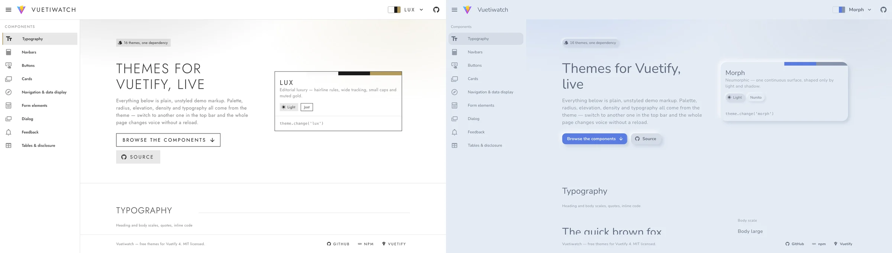

# Vuetiwatch

[](https://www.npmjs.com/package/vuetiwatch)
[](https://bundlephobia.com/package/vuetiwatch)
[](./LICENSE)

🎨 Free, plug-and-play themes for **[Vuetify 4](https://vuetifyjs.com/)** — what [Bootswatch](https://bootswatch.com/)
is to Bootstrap.

[](https://j-tap.github.io/vuetiwatch/)

**[See all nineteen themes →](https://j-tap.github.io/vuetiwatch/)**

Vuetify ships one look. Vuetiwatch ships nineteen, and they differ in more
than hue: radius, border weight, density, component variants, typography,
icons and motion all move together.

## Themes

| Name | Mode | Character |
| --- | --- | --- |
| `classic` | light | Stock Vuetify. Material Design, Roboto, familiar elevation |
| `paper` | light | Flat editorial — warm paper, ink accents, hairline borders, serif headings |
| `slate` | light | Dense dashboard — muted slate blue, compact density, outlined cards |
| `atlas` | light | Calm admin — soft neutrals, one cool accent, dense tables, hairlines not shadows |
| `atlasDark` | dark | The same panel after dark — soft greys, never pure black |
| `atlasSepia` | light | The same panel on warm paper and brown ink, for tired eyes |
| `calm` | light | Low contrast, desaturated naturals, no shadows, a lot of air |
| `lux` | light | Editorial luxury — hairline rules, wide tracking, small caps, muted gold |
| `soft` | light | Pastel and generous — large radii, diffuse tinted shadows, hearts for stars |
| `candy` | light | Plush and pillowy — warm cream, padded shapes, controls that squash |
| `clay` | light | Inflated pastel shapes with a triple shadow. Toy-like |
| `morph` | light | Neumorphic — one continuous surface, shaped only by light and shadow |
| `sketchy` | light | Hand-drawn wobble and pencil greys, for mockups and mirth |
| `brutalist` | light | Thick black rules, acid lime, hard unblurred shadows |
| `liquidGlass` | light | Capsule controls and refracting panes over a calm wash, after iOS 26 |
| `darkGlass` | dark | Frosted translucent surfaces on a deep violet ground |
| `aurora` | dark | Iridescent gradients on near-black — the showcase theme |
| `neon` | dark | Terminal black, cyan and magenta glow, zero radius, monospace headings |

`classic` is the control. It opts out of the core stylesheet entirely — not
one rule in this package matches a page running it — so switching to it
shows exactly what the other eighteen add.

## Quick start

```sh
npm i vuetiwatch      # or: bun add / yarn add / pnpm add
```

```ts
import { createVuetify } from 'vuetify'
import { createVuetiwatch, themeList, vuetiwatchThemes } from 'vuetiwatch'

import 'vuetify/styles'
import 'vuetiwatch/styles.css'

const vuetify = createVuetify({
  theme: { defaultTheme: 'paper', themes: vuetiwatchThemes },
})

createApp(App)
  .use(vuetify)
  .use(createVuetiwatch(vuetify, { themes: themeList }))
  .mount('#app')
```

That is the whole setup: `useTheme().change(name)` switches at runtime, and
the plugin swaps the component defaults that come with each theme.

## Documentation

- **[Package README](packages/vuetiwatch/README.md)** — installing, switching
  themes, accents, fonts, shipping a subset
- **[Writing your own theme](docs/authoring.md)** — `defineTheme`, overlay
  transitions, text selection, per-theme icons
- **[Theme variables](docs/theme-variables.md)** — every `vw-*` custom
  property the stylesheet reads, and what it moves
- **[What wins](docs/cascade.md)** — props, theme defaults, your defaults,
  Vuetify, and where your own CSS lands
- **[Contrast](docs/contrast.md)** — how the palettes are measured against
  WCAG 2 and APCA, and the one stated exception

## This repository

| Path | What it is |
| --- | --- |
| [`packages/vuetiwatch`](packages/vuetiwatch) | The published package |
| [`playground`](playground) | The demo behind the link above, deployed to GitHub Pages |

```sh
bun install
bun run dev          # builds the package, then serves the playground
bun run audit        # measures every theme's contrast
```

## Requirements

- **Vuetify 4.0+.** v3 is not supported: runtime font switching
  (`--v-font-body`, `--v-font-heading`) and `shadow-color` exist only in v4,
  and without them the themes lose most of what separates them.
- **Vue 3.5+**

## License

MIT
